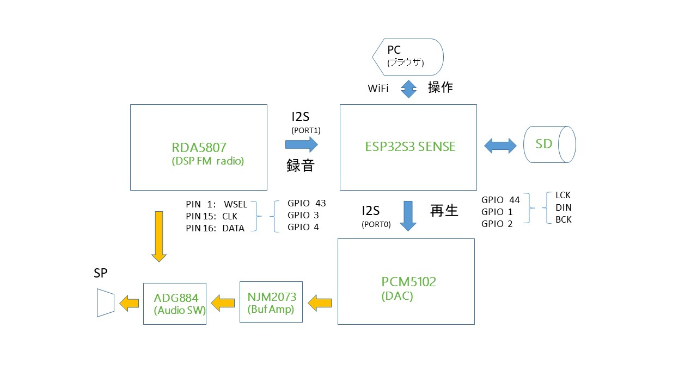
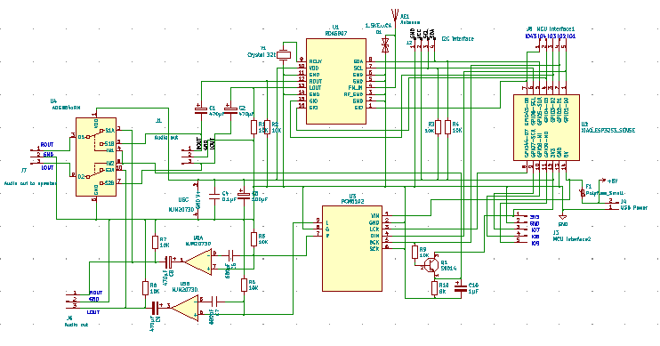
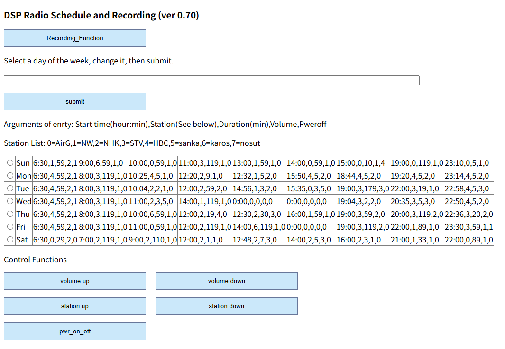
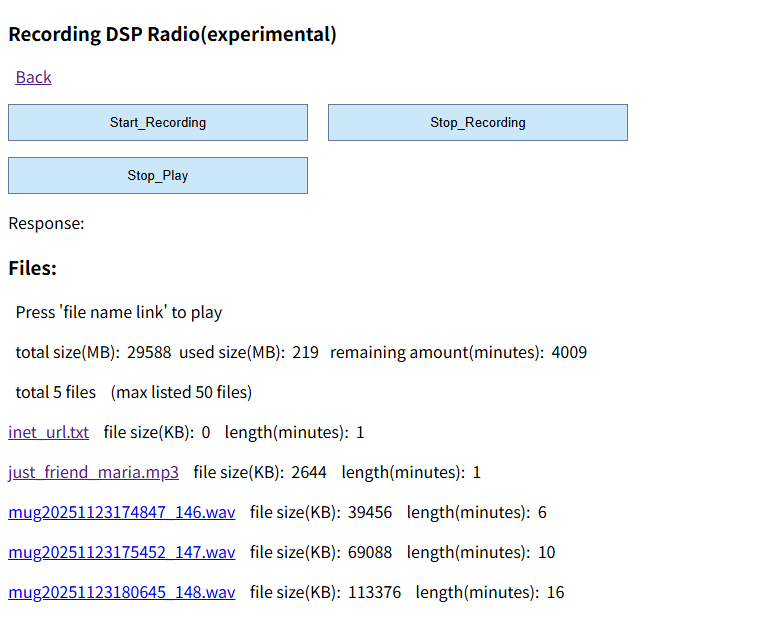
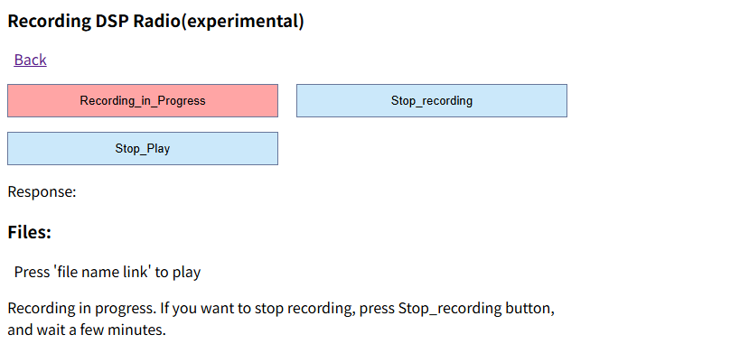
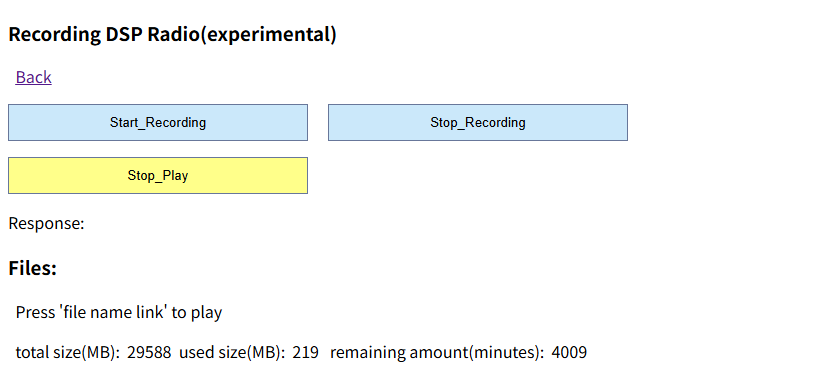

<H3>DSP Radio(RDA5807) with recording function to SD card using XIAO ESP32S3 SENSE(experimental)</H3>

FM DSPラジオ(RDA5807)に対し、それを制御する<a href="https://www.switch-science.com/products/8969">Seeed Studio XIAO ESP32S3 SENSE</a>の
SDカードに録音する機能を付加したので紹介する。 
DSPラジオはRDA5807FPを利用している（<a href="https://www.aitendo.com/product/4797">データシートの参照リンクあり</a>）。 
RDA5807FPには、I2S出力機能があり、XIAO ESP32S3 SENSEのI2Sポートで受信し、ディジタル化し、WAVファイルとして 
SDカードに書き込むことが可能である。 
また、DACにPCM5102モジュールを利用し、SDカードのWAVファイルを再生することも可能である。
構成は次の図を参照のこと。 
なお、この成果は経験にもとづくもので、「実験的（experimental）」である（動作を保証するものではない）。

 

操作には、Webブラウザを使用する。 開発はArduino IDE 2.1で行った。 
使用したRDA5807用のライブラリは、<a href="https://github.com/pu2clr/RDA5807">こちら（pu2clr at GitHub）</a>にある。 
なお、Arduino IDEのライブラリ管理からもインストール可能である。 
DAC用のI2SのライブラリaudioI2Sは、<a href="https://github.com/schreibfaul1/ESP32-audioI2S  ">こちら（GitHub）</a>を利用している。

<strong>機能</strong> 
 ・ベースは<a href="https://github.com/asmnoak/RDA5807_radio_ESP32C3_with_weekly_Schedule">週間スケジュールを設定できるFM DSPラジオ</a>。 
 ・操作はWiFi接続のブラウザから行う。 
 ・FM DSPラジオのI2S出力（32KBPS）をSDカード（WAVファイル）に録音できる。 
 ・録音したWAVファイルをDAC（PCM5102）モジュール経由で再生できる。 
 ・FMラジオとDACの出力をアナログスイッチADG884で切替えている。 
 ・OLED表示装置に、日付、曜日、時刻、音量、ラジオのON/OFF、受信周波数を表示する。 
 ・録音を週間スケジュールに設定できる。曜日ごとに、開始時間、長さ（分）、ラジオ局の番号、音量、終了後ON/OFFに「4」を指定する。 
　　例　13:00,1,59,1,4 
 ・（おまけの機能）SDカードに格納されたMP3ファイルの再生が可能。 
 ・（おまけの機能）ファイル名「inet_url.txt」にインターネットラジオ局のURLを指定（1行のみ）しておくとインターネットラジオ局に接続できる。 
 ・出力はオーディオジャック経由で小口径のスピーカー（ステレオ）を接続する。 

<strong>H/W構成</strong> 
 ・Seeed Studio XIAO ESP32S3 SENSE - コントローラ、SDドライブ 
 ・I2C接続&nbsp; RDA5807FP 
 ・I2S接続&nbsp; PCM5102モジュール　(UDA1334でも可) 
 ・I2C接続&nbsp; SSD1306 64x32 OLED表示装置 
 ・NJM2073　バッファアンプ 
 ・出力切替え&nbsp; ADG884 アナログスイッチ 
 ・トランジスタ S9014 (ADG884の切り替えに使用、ON時に2Vが得られる小信号用ならOK) 
 ・Xtal発振器（32768Hz）、コンデンサ、抵抗類、オーディオジャック、配線類 

<strong>回路図</strong>（PDFファイルあり） 
 

<strong>接続</strong> 
各コンポーネントの接続は回路図を参照のこと。 
プルアップ抵抗（R3,R4）は配線の長さに注意すれば省略可である。 
XIAO ESP32S3 SENSEのGPIOは全て使用されていて、空きがない。 

<strong>インストール</strong> 
<ol>
<li>コードを、ZIP形式でダウンロード、適当なフォルダに展開する。</li>
<li>ArduinoIDEにおいて、ライブラリマネージャから以下を検索してインストールする</li>
 <ul>
  <li>Adafruit_BusIO</li>
  <li>Adafruit_GFX</li>
  <li>Adafruit_SSD1306</li>
  <li>RDA5807</li>
 </ul>
<li>追加のライブラリを、ZIP形式でダウンロード、ライブラリマネージャからインストールする</li>
 <ul>
  <li>TimeLib&nbsp;:&nbsp; https://github.com/PaulStoffregen/Time</li>
  <li>Audio　-　audioI2S</li>
 </ul>
<li>ArduinoIDEからxiao_esp32_sense_rda5807_pcm5102_SD_wav_master.inoを開く</li>
<li>「検証・コンパイル」に成功したら、一旦、「名前を付けて保存」を行う</li>
<li>利用するWiFiのアクセスポイントに合わせて、スケッチのssid、passwordを編集する。</li>
<li>ローカルのラジオ局の周波数"stnFreq"と局名"stnName"を設定する。</li>
</ol>

<strong>ブラウザの画面</strong> 

１．ブラウザから「http://192.168.x.y」&nbsp;（x.yは起動時、OLEDに表示） にアクセスする。DSPラジオの操作と週間スケジュールの設定画面を表示する。 
「Recording_Function」ボタンを押す。 
 

２．録音の操作と録音ファイルのリストおよび再生の操作。 
 

３．録音開始（既定では、30分で自動停止、変更はスケッチの「MAX_RECORD_TIME」を修正する）。 
 

４．ファイル名をクリックすると再生を開始する。なお、再生中は、OLEDの表示は停止する。 
 

<strong>注意事項</strong> 
・SDカードは、「SD」、「SDHC」（32GBまで）タイプに対応。ファイルサイズは2GBまで。クラスタサイズ32KBでフォーマットする。 
・SDカードへの書き込みでエラーが発生することがあり、SDカードの再フォーマットが必要になるケースがあります。SDカードは専用とし、 
　 <strong>保存が必要なデータは決して置かないでください</strong>。 
・30分の録音で、ファイルサイズが220MB程度になります。ファイルサイズ(max 2GB)とSDカードの容量に注意。容量超過でエラーになると 
　 SDカードの再フォーマットが必要になることがあります。 
・ArduinoIDEのシリアルモニターにトレース情報を出力しています。 
・一通りの動作は確認していますが、まだ、bugはあると思います。 
・動作を保証するものではありませんので、利用の際は、自己責任でお楽しみください。 

